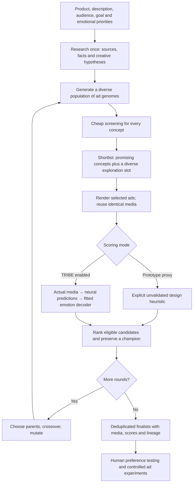

# Product and implementation plan

The product should discover a small set of compelling, distinct ad drafts through a genuine population search. It should optimize a user-specified response while preserving product identity and factual support, and expose why a concept survived. The visible lineage from the shared idea is central: every candidate has a genome, parents, a named mutation, a rendered artifact when selected, and a score with provenance.

## Pipeline



The prototype offers an immediately runnable offline demonstration plus implemented live-provider paths. It never treats generated or unavailable measurements as observations. The UI separates brief-derived hypotheses, searched evidence, unrendered concepts, local illustrations and generated images.

## Brief, research and genome

Inputs implemented: product name, description, audience, natural-language goal, relative weights for joy/trust/curiosity/desire, rounds, population, shortlist size, seed, generation mode and scoring mode. Weights are nonnegative and normalized by their sum. Zero weight means that dimension contributes nothing; it does not request a low value for that emotion. Additional named emotions or signed target ranges require changing the decoder/schema.

Live research is a single required web-search pass. Evidence claims must reference sources actually returned by the search tool. Creative hypotheses remain labeled. Research is supplied to the model when creating initial concepts and writing descendants. It does not prove that all product claims are true, or make retrieved pages trusted instructions.

Current genome:

```json
{
  "hook": "A recognizable afternoon pause",
  "visual": "A bright citrus product close-up",
  "emotion": "curiosity",
  "proof": "Show the no-added-sugar feature described in the brief",
  "cta": "Discover PULSE",
  "palette": "sage ivory"
}
```

Each candidate also stores headline, body, CTA, parents, generation and mutation. Live generation writes initial genomes; later generations inherit genes using the engine's operators, and the model writes copy consistent with those genes. An unchanged elite preserves its copy and asset. Demo copy/art are deliberately limited templates. Live mutations currently draw from small generic gene pools; research-conditioned mutation proposals and explicit gene constraints are a useful next improvement.

For video, extend the genome with shot sequence, shot duration, camera, reveal timing, narration, sound, transitions, logo timing and temporal response targets. Start with a short, editable scene and reuse unchanged segments. Keep copy in the rendered artifact, not only in invisible metadata.

## Selection and scoring

Implemented fitness is the weighted mean of the four 0–100 scores:

`fitness = Σ(weight[e] × score[e]) / Σ(weight[e])`

The inexpensive heuristic is a transparent keyword/design prior over copy and genes. It is useful to demonstrate search and control expensive calls, but is easily optimized through its own vocabulary and does not inspect pixels or measure emotional response. Even live image generation with this heuristic cannot establish that an ad is good.

Each round uses the proxy to choose a shortlist; one slot prefers genome distance to preserve exploration. This is a simple diversity rule, not Bayesian optimization. Then:

- Proxy mode ranks the entire population using the same heuristic.
- TRIBE mode ranks only candidates evaluated by the worker or carried forward with identical cached media and decoder results. Proxy scores never compete directly with decoder estimates. Unscored concepts remain visible with their own source labels.
- The highest-scoring eligible candidate is retained unchanged. A second parent balances score with genome distance. Crossover chooses genes from parents; one or sometimes two genes mutate.
- Finalists come from the distinct eligible archive across all rounds. There are up to three, and identical genomes/copy are deduplicated. Distinct genomes can still yield visually similar images; visual deduplication is not implemented.

Next, add separate acceptance gates for product identity, claim support, legibility and brand constraints. Keep diversity in survivor selection. Compare a weighted objective against a Pareto frontier so a high-arousal but unclear creative cannot win purely through emotional intensity. Avoid arbitrary penalties before they have a defined label and evaluation protocol.

## Where TRIBE fits

Meta's model predicts average-subject cortical activity, not four ready-made advertising emotion values. The released model/code uses CC-BY-NC licensing, and its default stack includes gated/large encoders. The official implementation exposes video/audio/text prediction, rather than a direct image emotion endpoint. These are concrete integration constraints. See [research and primary sources](TRIBE_RESEARCH.md).

The included Python bridge presents actual generated square PNGs as silent 30-second videos. It pools neural output after five initial samples, then applies a separately fitted ridge decoder. That presentation/pooling choice is **an experimental protocol** and needs matching human labels; it is not validated as a feed-ad response measure. No pretrained head is shipped. The worker exposes `/features` to collect neural features before a decoder exists.

A valid study would collect consented audience ratings, split by product/campaign and creative family, fit only on the training split, and compare held-out ranking against simple text/image models and human judgments. The supplied fitting script reports held-out error and a constant baseline. Its synthetic fixture tests the numerical code only. Successful fitting is not scientific validation, and per-item uncertainty stays `null`.

Cache keys include the exact image hash, model revision, code revision and presentation protocol. Decoder versions are explicit. Raw predictions are stored separately from emotion outputs, so a fitted head can change without recomputing neural features. Evaluation metadata, including the stimulus hash, protocol and validation metadata, stays in the run export. Operator-provided revision strings must actually correspond to installed code and weights.

## Latency plan

There is no defensible published per-ad runtime or minimum-VRAM guarantee in the inspected sources. Measure stage timings on the actual GPU before setting a latency promise.

| Change | Prototype status | Benefit / cost |
| --- | --- | --- |
| One research pass per run | Implemented | Avoid repeated research per candidate |
| Genomes before media | Implemented | Keep most population members cheap |
| Top candidates plus diversity slot | Implemented | Fewer heavy evaluations, with some coverage beyond proxy favorites |
| Two parallel image requests | Implemented | Overlap independent renders within provider limits |
| Champion and identical-candidate cache | Implemented within a run | Avoid repeated generation and scoring of unchanged candidates |
| Content-addressed neural cache | Implemented in optional worker | Reuse repeated actual stimuli across calls and decoder versions |
| Resident GPU model | Implemented after first request | Avoid repeated model loading; first call remains cold |
| Skip ASR for silent static ads | Implemented via upstream helper | Avoid unnecessary transcription and hallucinated words on silence |
| Vectorized GPU batching | Not implemented | Profile memory and upstream batching before adding |
| Trained cheap surrogate / uncertainty sampling | Extension | Reduce TRIBE work once an evaluation dataset exists |
| Scene-level feature reuse | Extension | Requires correct context dependencies and invalidation |
| Early stopping on plateau | Extension | Saves later rounds; current run respects requested N |
| Quantization, lower feature resolution, changed encoders | Experiment only | Must test rank fidelity; not safe drop-in toggles |

For population `P`, rounds `R`, shortlist `K`, the current TRIBE path evaluates at most `(R − 1) × K + max(3, K)` candidate slots before cache hits (`P ≥ 4`). The exploration slot is included in `K`. With defaults `P=8, R=3, K=3`, that is at most **9 expensive evaluations instead of 24**, a **62.5% reduction in candidate evaluations**, not a measured runtime speedup. Cached elites may reduce it further. Proxy mode may render up to three additional archived finalists.

Approximate wall time is one research pass plus, per round, one concept/copy call, image jobs in groups of two, then the worker's serial uncached inference. The 15-minute worker request timeout and 20-minute run limit are bounds, not completion guarantees. A TRIBE batch contains several candidates but is processed serially by the Python service.

Benchmark cold and warm runs separately. Record preprocessing, each encoder, TRIBE forward pass, decoding, image generation, VRAM, cache hits, failures and rank agreement. Compare full-population search, shortlist search and a cheaper embedding-only baseline at equal cost. Include diverse stimuli so the cache does not make throughput appear representative of uncached work.

## Delivery stages

1. **Workflow prototype — implemented:** local UI, research/provider contracts, genomes, real evolutionary operators, shortlist, proxy scores, images, lineage, export, tests, optional official TRIBE bridge and a fitting utility.
2. **First real run:** provision model access and a GPU environment; pin dependencies; run the worker feature path on actual generated PNGs; measure time/VRAM; verify content hashes and neural shapes. Supply API credentials for real web research and image generation.
3. **Validate the objective:** obtain human ratings and representative held-out ads, fit/calibrate a decoder, assess ranks and uncertainty, compare cheaper baselines. Establish whether TRIBE adds useful information at all.
4. **Video search:** add short-scene generation and a render manifest, timed narration, fixed seeds/reference media, scene reuse and final assembled-media evaluation. Refit or validate the decoder for the new stimulus protocol.
5. **Product pilot:** use consented human preference tests followed by controlled ad experiments. Add a durable job queue, actual usage/cost budgets, access control and deployment infrastructure when running beyond this local prototype.

## Extensions and missing pieces

- **Emotional validity:** a target-audience dataset, usable emotion head, uncertainty, bias checks, and evidence that model-fitness gains transfer to human ratings. No marketing-effectiveness claim follows from TRIBE alone.
- **Performance evidence:** real GPU integration testing and stage-level cold/warm benchmarks. Current tests use stubs and local fixtures; no paid calls or GPU execution were performed.
- **Richer constraints:** product photos/references, brand kit, banned/required claims, format/channel, locale, duration and render budget. The current description-only prompt cannot guarantee visual product identity.
- **Better search:** research-conditioned mutations, adaptive mutation rates, multiple creative niches, trained screening, novelty checks, early stopping and resumable budgets.
- **Media quality:** image-reference edits, final-quality re-rendering and re-evaluation, video providers, narration/audio, OCR and human approval. Current images use low quality and are delivered as drafts without a separate polish pass.
- **Real outcome feedback:** collect independent human preference signals and later controlled CTR/conversion results; do not infer user liking, desire or purchasing from raw cortical activity.
- **Operations:** external credentials, licensed commercial use, hard worker cancellation, retries with idempotency, per-stage usage accounting, durable queues and multi-user controls. Local cancellation cannot stop an already-running GPU kernel; it prevents subsequent pipeline work.
- **UI verification:** no controllable browser surface was available during implementation. Syntax, CSS/markup and HTTP paths were checked, but an interactive browser/visual pass remains necessary.

The smallest next experiment is a fixed set of representative ads rated by people, scored by TRIBE plus a fitted head and by cheaper baselines. If TRIBE does not improve held-out ranking enough to justify its latency, keep the evolution engine and replace the scorer.
